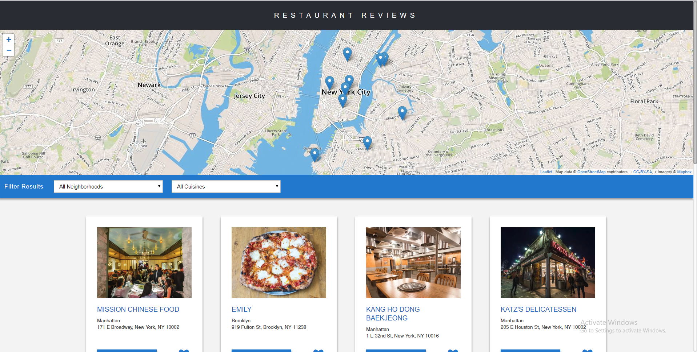
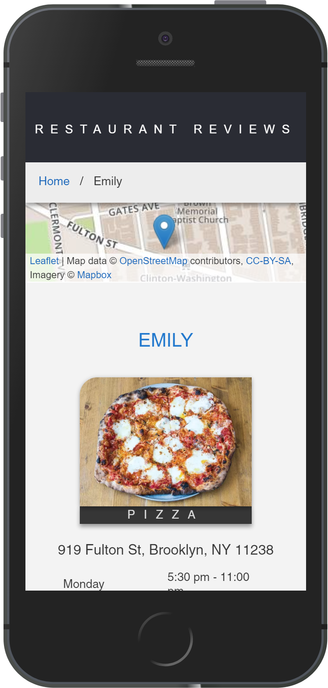

# Udacity Mobile Web Specialist Nanodegree

## About this project

This project is made by Mobile Web Specialist Nanodegree's Project stage 1 and 2 combined.
This repository consists of end to end functionalities of all the project stages.

## Restaurant Review App Stage 3

For the **Restaurant Reviews projects**, we will incrementally convert a static webpage to a mobile-ready web application. In **Stage 3**, we'll add a form to allow users to submit their own reviews. We'll add functionality to defer submission of the form until connection is re-established. We'll follow the recommendations provided by Lighthouse to achieve the required performance targets.

## Setup & Run

Run the following commands in order to launch the application.

```
npm install
gulp build
gulp serve
```

The application will be running at http://localhost:9000/


## Screenshots

The screenshots give a brief overview of the application features.

### Desktop View (Restaurants)


### iPhone 5SE View (Reviews)



## Made By Abinash